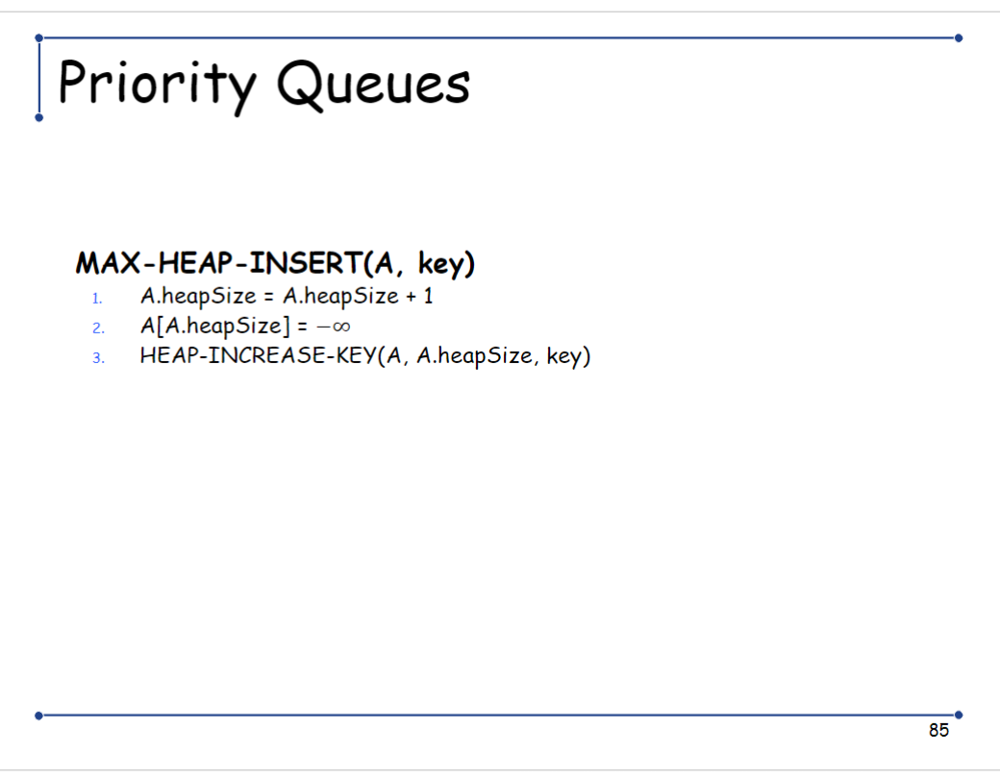

# *UNIST CSE331 Algorithm Class Assignment 1 code

~~Well, I think I'll implement it in C++ or python, idk for now~~  

PYTHON IS GOD  
So I choose to use python 3.13  
I heard it is faster than previous version, so I'll use it.  

Anyway, now I need to implement 12 algorithms

[x] Merge Sort  
[x] Heap Sort  
[x] Bubble Sort  
[x] Insertion Sort  
[x] Selection Sort  
[x] Quick Sort  

Annnnnnnnnnnnnnd

[ ] Library Sort  
[ ] Tim Sort  
[ ] Cocktail Shaker Sort  
[ ] Comb Sort  
[ ] Tournament Sort  
[ ] Intro Sort

Yeah, Idk why I start it in 1:00 am on the submission due date...  
Cause I thought the due date is 4/16! HAHAHA...  

Waitwaitwait, should I test all data in **FOUR** type of data???

Anyway, let's start

## Insertion Sort, my first algorithm for assignment  

It uses an incremental approach (Written in ppt slide)  
  

## Next is umm... Merge Sort!  

  
  

## Now it's time for Heap sort  

  




## Now Quick Sort  

  

## Bubble Sort

```python
def bubble_sort(A):
    for i in range(len(A)-1, 0, -1):
        for j in range(0, i):
            if A[j] > A[j+1]:
                A[j], A[j+1] = A[j+1], A[j]
    return A
```

## Selection Sort  


